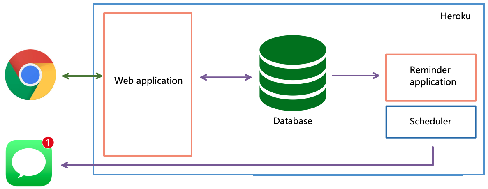

# iPromise -- created by:

Chuan Cheng - https://github.com/nervecell23  
Evelina Clayton - https://github.com/EvelinaClayton  
Hanna Aikas - https://github.com/HannaAikas  
Imane Ben-touhami - https://github.com/monmon8  
Lauren Harris - https://github.com/LaurenLau

To see the app in action, please visit:

https://cryptic-thicket-87200.herokuapp.com/sign_in

## What is iPromise?

|                     Github link                     |                                                           Description                                                           | Development Time-frame |          Technologies used           |              Testing & Deployment               |
| :-------------------------------------------------: | :-----------------------------------------------------------------------------------------------------------------------------: | :--------------------: | :----------------------------------: | :---------------------------------------------: |
| [iPromise](https://github.com/nervecell23/iPromise) | Web App: Allows users to make promises for personal improvement and set an appropriate “punishment” if they fail to keep these. |        2 weeks         | Ruby on Rails, HTML, CSS, PostgreSQL | RSpec, Factory_bot, Capybara, Travis CI, Heroku |

## This project has the following features:


**Top-level diagram**



**From a user perspective:**

- Authentication (user can sign up, log in, log out)

- A user can create and edit a new promise

- A user can set an appropriate “punishment” for each promise i.e. something they will do if they break this promise

- A user receives daily text messages to remind them of their promise(s)

- A user receives a final text message on the end date of the promise, asking them to confirm whether they kept the promise. This will take them to a ‘congratulations’ page or a ‘Oh no, you broke your promise’ page.

**In the background:**

- In the background, the app has a database that stores details of users and their promises

- There is also a separate “reminder” program that talks to this database, periodically checks when it is time to send out a text message, and sends an appropriate text message

- Users will receive a daily text message reminding them of their promise

- On the end date of the promise, they will receive a text message asking them to click a link to confirm whether or not they kept their promise. This will open the app on their mobile phone browser, ask them to log in, and then show them either the “congratulations” page, or the page that reminds them of their “punishment” for breaking the promise.

## Quick start

First, clone this repository. Then:

```bash
> bundle install
> bin/rails db:create
> bin/rails db:migrate
```

Then:

```bash
> bin/rails server # Start the server at localhost:3000
```

To test iPromise using Rspec:

```bash
> rspec
```

Ruby version: 2.6.3p62

---

## Next Steps:

This app was developed under strict time constraints, and we suggest the following features to be added for future versions:

- Input validation: Validate user inputs, and provide helpful pop-up messages if e.g. they leave password blank, or have a password that doesn’t meet criteria. Could also validate other inputs e.g. valid UK mobile number.

- Database: Add field to each promise so that we can update whether the promise is “live” or “completed”. Link this to front-end – on promises/index, split into “current” vs “past” promises.

- Front End: React components, or possibly develop a stand-alone front-end app (using React) that would talk to the Rails back-end app.

- Add Feature: More pre-populated categories of promises (and punishments) that the user could select.

- Add Feature: Ability to nominate a friend to monitor whether or not you keep your promise and report back to the app.

- Add Feature: Link “punishments” category to a charity side (e.g. investigate Just Giving API) so that users could pledge to donate money to charity if their fail to keep the promise.

- Add Feature: If user doesn’t respond to final text message (asking them to confirm if they kept their promise), send them a reminder text message.
